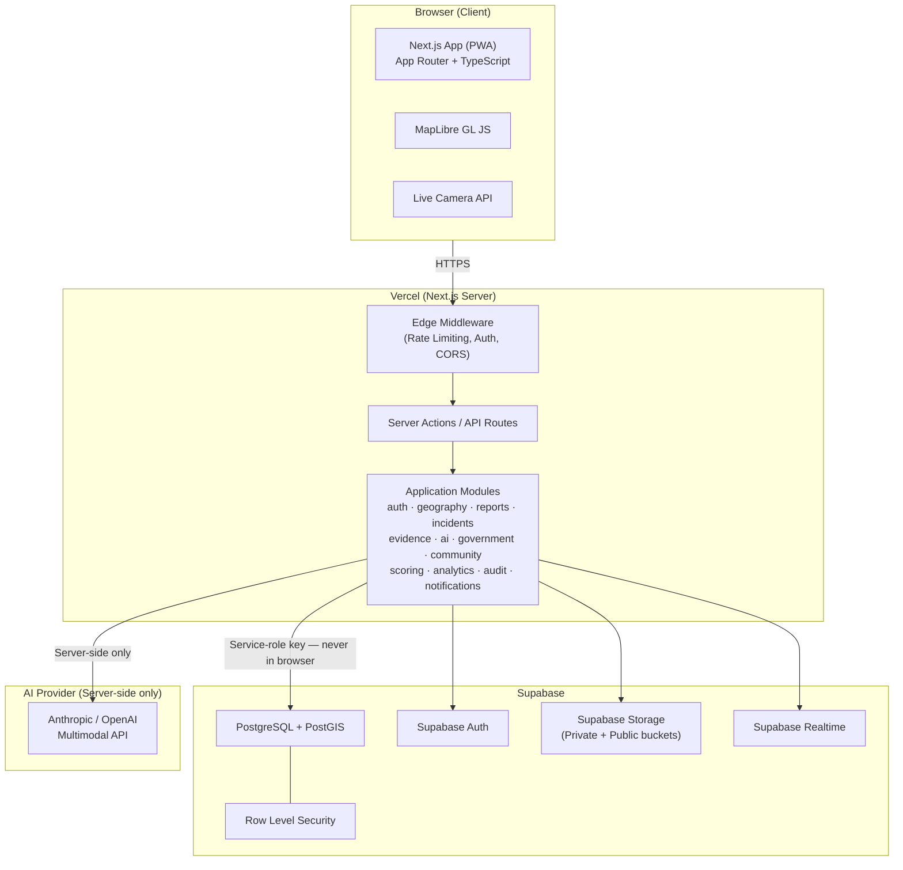
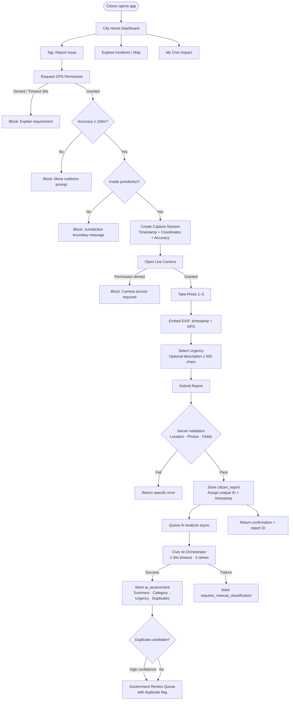
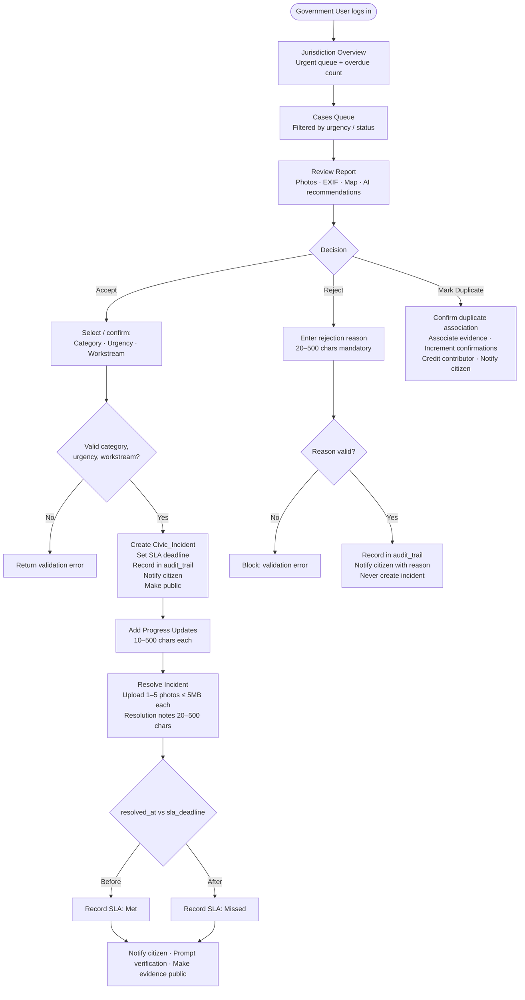
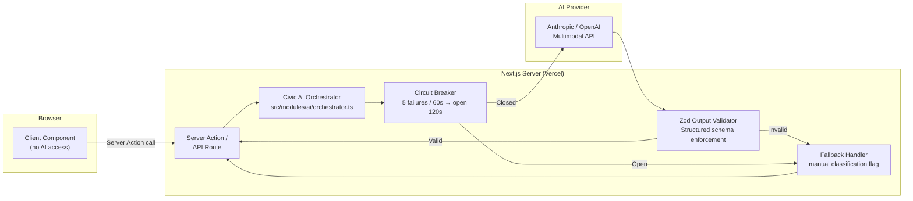
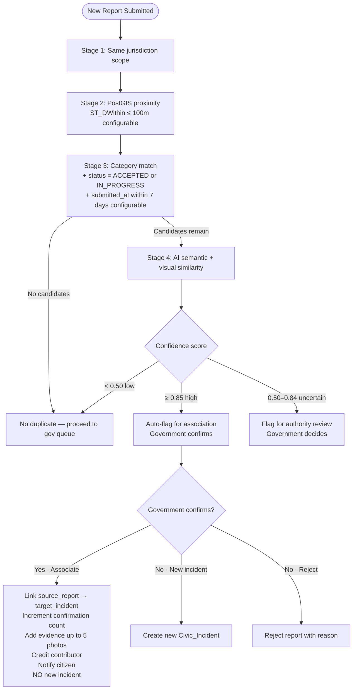
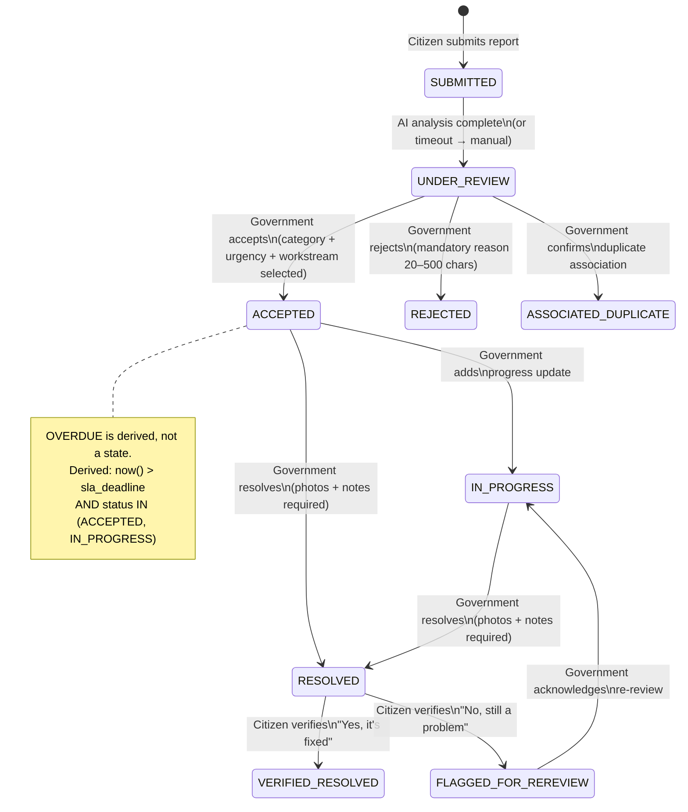
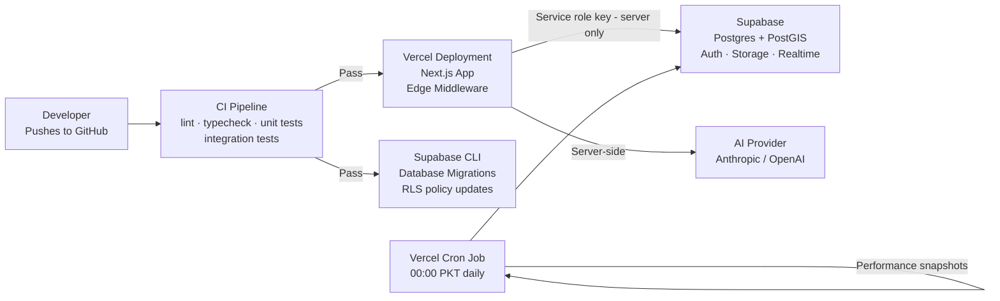
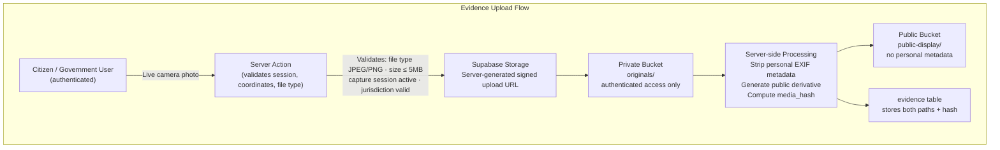

# CivicPakistan — Design Document

---

## Overview

CivicPakistan is a **modular monolith** — one deployable Next.js application backed by Supabase. There are no microservices, no message brokers, and no separate API backends. All AI calls are made server-side. The boundary between modules is enforced by directory structure and TypeScript import discipline, not by network boundaries.

**Key deployment topology:**

| Layer | Technology | Hosting |
|---|---|---|
| Frontend + Server | Next.js 14+ (App Router), TypeScript | Vercel |
| Database | PostgreSQL 15 + PostGIS | Supabase |
| Authentication | Supabase Auth (JWT) | Supabase |
| File Storage | Supabase Storage (S3-compatible) | Supabase |
| Realtime | Supabase Realtime (WebSocket) | Supabase |
| AI | Civic AI Orchestrator → Anthropic/OpenAI | Server-side only |
| Maps | MapLibre GL JS (provider-flexible) | Client-side |
| Schema Migrations | Supabase CLI in repository | CI/CD |

### Key Design Decisions and Rationale

| Decision | Rationale |
|---|---|
| **Modular monolith over microservices** | Pakistan civic context demands reliability over distributed complexity. One deployment, one database, no network partitions between modules. |
| **Supabase over custom backend** | Supabase provides Auth, RLS, Realtime, Storage, and PostGIS as a managed platform. Eliminates an entire class of infrastructure. |
| **Next.js App Router** | Co-locates server and client code. Server Actions enforce server-side-only AI and service-role key usage naturally. |
| **Incident as core entity** | One civic problem = one incident, regardless of how many citizens report it. Prevents duplicate noise and enables accurate accountability tracking. |
| **OVERDUE as derived condition** | OVERDUE is not a lifecycle state — it is computed from `now() > sla_deadline`. This avoids a background job that mutates statuses and removes the risk of stale state. |
| **Append-only audit and ledger** | No UPDATE/DELETE on `incident_events`, `contribution_ledger`, or `audit_logs`. Government accountability cannot be retroactively altered. |
| **AI as recommendations only** | AI never makes accept/reject/resolve decisions. Government users remain accountable for every lifecycle transition. |
| **PostGIS for geofencing** | `ST_Within` / `ST_DWithin` on boundary `geography` columns. Server-trusted — client provides coordinates, server validates containment. Client coordinates are never trusted directly. |
| **MapLibre over Google Maps** | Provider-flexible, open-source, no per-request API key billing risk. Tile provider can be swapped without code changes. |
| **Private/public evidence split** | Originals stored in private Supabase Storage bucket. Public derivatives served from public bucket after metadata stripping. Enables future redaction without requiring it in v1. |
| **Configurable policy defaults** | SLA thresholds, scoring weights, proximity windows, and retention periods are stored configuration — not hardcoded constants. |

---

## Architecture



### Citizen Flow



### Government Flow



### AI Architecture and Trust Boundary

The Civic AI Orchestrator is a server-side abstraction. The browser never calls the AI provider directly.



**AI inputs (per analysis request):**
- Report ID, photos (base64 or storage URL), GPS coordinates, urgency, optional description

**AI outputs (Zod-validated schema):**
```typescript
const AIAssessmentSchema = z.object({
  summary: z.string().max(200),
  suggested_category: z.string(),
  suggested_urgency: z.enum(['URGENT_HAZARD', 'MAINTENANCE']),
  suggested_workstream: z.string(),
  duplicate_candidate_ids: z.array(z.string().uuid()),
  confidence: z.number().min(0).max(1),
})
```

**AI reliability contract:**
1. Citizen report is persisted to `citizen_reports` BEFORE AI dispatch
2. AI runs asynchronously after HTTP response returned to citizen
3. Timeout: 30 seconds; Retries: 3× exponential backoff (1s → 2s → 4s → max 30s)
4. Circuit breaker: 5 failures in 60s → open for 120s → half-open test → close or reopen
5. On any failure: mark `ai_assessments.failed = true`, set `requires_manual_classification`
6. Government users can always proceed without AI recommendations

**AI must NOT:**
- Write to `incident_events`, `incidents`, `audit_logs`
- Accept, reject, or resolve incidents
- Calculate `contribution_ledger` deltas or `performance_snapshots`
- Be called from client-side code

### Geographic / Geofence Architecture

#### Jurisdiction Hierarchy

Pakistan uses a flexible self-referencing hierarchy. The user-facing labels are simplified to Pakistan → Province/Region → City/Local Area, but the internal model supports up to 5 subdivision levels.

```sql
jurisdictions (
  id          uuid PRIMARY KEY,
  name        text NOT NULL,
  parent_id   uuid REFERENCES jurisdictions(id),  -- self-reference
  level_label text,  -- 'country' | 'province' | 'division' | 'district' | 'tehsil' | 'local'
  boundary    geography(MULTIPOLYGON, 4326),       -- PostGIS
  metadata    jsonb,
  created_at  timestamptz DEFAULT now()
)
```

No hardcoded level columns. The tree depth is determined by the `parent_id` path, not by a numeric column.

#### Geofence Validation Flow

All boundary validation executes server-side using PostGIS:

```sql
-- Is a report coordinate inside the citizen's registered jurisdiction?
SELECT ST_Within(
  ST_SetSRID(ST_MakePoint($lon, $lat), 4326)::geography,
  boundary
) FROM jurisdictions WHERE id = $citizen_jurisdiction_id;
```

**Coordinate precision policy:**
- Internal storage: full GPS precision (up to 8 decimal places)
- Contribution ledger / audit: 50-meter precision (rounded server-side)
- Public map display: ~100-meter precision (server-side truncation before API response)

#### Geographic Indexes

```sql
CREATE INDEX idx_jurisdictions_boundary ON jurisdictions USING GIST(boundary);
CREATE INDEX idx_citizen_reports_coordinates ON citizen_reports USING GIST(coordinates);
CREATE INDEX idx_incidents_coordinates ON incidents USING GIST(coordinates);
```

### Duplicate-Resolution Architecture

Duplicate detection is a staged pipeline — each stage reduces the candidate set before the more expensive next stage.



**Recurrence detection:**
When a report arrives for a location within 50m of a `VERIFIED_RESOLVED` incident, a new incident is created and linked via `duplicate_links` with `association_type = 'RECURRENCE'`. This preserves the resolution history while acknowledging the problem has returned.

### Incident State Machine



**State transition enforcement:**
- Every valid transition calls `incident_events` INSERT (append-only)
- Server-side state machine validates current status before allowing transition
- Invalid transitions return HTTP 409 with descriptive error
- State is authoritative in `incidents.status`; `incident_events` is the audit history

**SLA derivation:**
```typescript
const isOverdue = (incident: Incident): boolean =>
  ['ACCEPTED', 'IN_PROGRESS'].includes(incident.status) &&
  new Date() > incident.sla_deadline
```

This is computed at query time, never stored as a status column.

### Realtime Architecture

Supabase Realtime is used selectively. Not every data change triggers a realtime subscription.

| Subscription | Channel | Consumers | Trigger |
|---|---|---|---|
| Incident status change | `incident:{id}` | Reporting citizen | `incident_events` INSERT |
| New official update | `incident:{id}:updates` | Public viewers | `government_updates` INSERT |
| New report arrived | `gov:queue:{jurisdiction_id}` | Government users | `citizen_reports` INSERT |
| Dashboard stats | `dashboard:{jurisdiction_id}` | Citizen home | Throttled aggregate, max 1 per 30s |
| Notification | `notify:{user_id}` | Authenticated user | `notifications` INSERT |

Analytics queries, leaderboard rankings, and performance scores are NOT realtime — they are fetched on-demand or refreshed on navigation. The dashboard stats channel uses server-side throttling to prevent flooding.

### Scoring Architecture

#### Citizen Civic Impact Score

The score is derived entirely from `contribution_ledger`, which is append-only.

```typescript
// Score = SUM(points_delta) WHERE citizen_id = X, floored at 0
const score = Math.max(0, ledger.reduce((sum, row) => sum + row.points_delta, 0))
```

**Ledger event types and point values (policy defaults — configurable):**

| Event | Points |
|---|---|
| Report accepted as new incident | +10 |
| Report associated as duplicate contribution | +5 |
| Incident confirmed | +3 |
| Verification: "Yes, it's fixed" | +5 |
| Verification: "No, still a problem" | +3 |
| Report rejected: spam | −5 |
| Report rejected: fabricated | −5 |
| Report rejected: duplicate | 0 |
| Report rejected: out of scope | 0 |
| Report rejected: insufficient evidence | 0 |

Score floor: `Math.max(0, calculatedScore)` — score never goes below 0.

Concurrent event safety: ledger rows are inserted atomically via database transactions. Score is always re-derived from the ledger sum, never maintained as a mutable counter.

#### Government Civic Performance Score

Derived from `incident_events`, `resolution_verifications`, `incidents`, and `sla_policies`. Never from AI ratings.

```
composite = (0.40 × sla_compliance_rate)
          + (0.30 × verified_resolution_rate)
          + (0.20 × response_timeliness_score)
          + (0.10 × backlog_health_score)

response_timeliness_score = max(0, 1 - avg_first_response_hours / 48)
backlog_health_score       = max(0, 1 - overdue_percentage / 100)
```

Zero-denominator handling: when divisor = 0, treat the rate as 100% (no data = full credit).

Snapshots are written to `performance_snapshots` daily at 00:00 PKT by a scheduled Vercel Cron Job. Province scores = mean of city scores; Pakistan score = mean of province scores.

### Deployment Architecture



**Environment variables (never in browser bundle):**

```
SUPABASE_SERVICE_ROLE_KEY    # Server-side only
AI_PROVIDER_API_KEY          # Server-side only
DATABASE_URL                 # Server-side only
NEXT_PUBLIC_SUPABASE_URL     # Safe for browser (public)
NEXT_PUBLIC_SUPABASE_ANON_KEY # Safe for browser (public, RLS-protected)
NEXT_PUBLIC_MAPTILER_KEY     # Map tile provider (if needed)
```

**Migration workflow:**
- `supabase/migrations/` directory in repository
- Supabase CLI applies migrations on merge to main
- PostGIS extensions enabled in migration bootstrap

**No Kubernetes. No message brokers. No separate microservices.**

---

## Components and Interfaces

Each module lives under `src/modules/{name}/` and exposes a typed service interface. Modules communicate through direct TypeScript imports — never through HTTP between themselves.

```
src/
├── modules/
│   ├── auth/           # Registration, login, session, MFA (admin), role assignment
│   ├── geography/      # Jurisdiction CRUD, PostGIS boundary queries, geofence validation
│   ├── reports/        # Citizen report creation, capture session, live-camera flow
│   ├── incidents/      # Civic incident lifecycle, state machine, SLA engine
│   ├── evidence/       # Photo upload, storage management, public/private split
│   ├── ai/             # Civic AI Orchestrator, prompt construction, structured output, fallback
│   ├── government/     # Review queue, accept/reject/update/resolve workflows
│   ├── community/      # Confirmations, citizen comments, official government updates
│   ├── scoring/        # Contribution ledger, performance snapshots, score derivation
│   ├── analytics/      # Civic intelligence queries, aggregated views
│   ├── audit/          # Append-only audit log writes and reads
│   └── notifications/  # In-app + async notification dispatch
├── app/                # Next.js App Router pages, layouts, server actions
├── components/         # Shared UI components
├── lib/                # Supabase client, PostGIS helpers, Zod schemas, config loader
└── types/              # Domain type definitions
```

**Module dependency rules:**
- `ai` may only be imported from server-side code (Server Actions, API routes, not client components)
- `audit` is write-only from all modules; only `government` and `analytics` read it
- `scoring` receives events from `reports`, `incidents`, `community`, and `government` — never writes directly to `incidents`
- `geography` is a dependency of `reports`, `incidents`, and `government`

### API / Service Boundaries

All external-facing API surface is through Next.js App Router. No separate Express/FastAPI server.

#### Server Action groupings

| Module | Server Actions / Routes |
|---|---|
| `auth` | `registerUser`, `loginUser`, `resetPassword`, `logoutUser`, `getSession` |
| `geography` | `getJurisdictions`, `createJurisdiction`, `validateCoordinates`, `getJurisdictionBoundary` |
| `reports` | `createCaptureSession`, `submitReport`, `getMyReports` |
| `incidents` | `getIncident`, `listIncidents`, `getIncidentTimeline`, `getPublicMap` |
| `government` | `getReviewQueue`, `acceptReport`, `rejectReport`, `addProgressUpdate`, `resolveIncident` |
| `community` | `confirmIncident`, `addComment`, `submitVerification` |
| `scoring` | `getCitizenScore`, `getCityLeaderboard`, `getPerformanceScore` |
| `analytics` | `getCivicInsights`, `getJurisdictionStats` |
| `ai` | Internal only — never exposed as a public route |

#### Public API endpoints (unauthenticated)

```
GET  /api/public/incidents?jurisdiction=&status=&category=&urgency=&from=&to=
GET  /api/public/incidents/[id]
GET  /api/public/map?jurisdiction=&zoom=
GET  /api/public/stats?jurisdiction=
GET  /api/public/performance?jurisdiction=
```

All public endpoints strip personal metadata from responses server-side.

### Authorization / RLS Model

#### Two-layer enforcement

```
Layer 1: Next.js Server (Server Actions / API Routes)
  ↓ checks role + jurisdiction from JWT / profiles table
Layer 2: Supabase Row Level Security
  ↓ database-level enforcement as defense-in-depth
```

The server layer is the primary enforcement point. RLS is the safety net — it ensures that even a compromised server action cannot leak cross-jurisdiction data.

#### Role definitions

| Role | Assigned via | Capabilities |
|---|---|---|
| `citizen` | Default on registration | Create reports, confirm, comment, verify resolutions, view public incidents |
| `government_user` | Platform_Admin via admin API | Review queue, accept, reject, update, resolve (jurisdiction-scoped) |
| `platform_admin` | Direct DB assignment only | All operations, user management, system config, audit history |

#### Critical RLS policies

```sql
-- Citizens can only see accepted/public incidents
CREATE POLICY "public_incidents" ON incidents
  FOR SELECT USING (is_public = true);

-- Citizens can only see their own reports
CREATE POLICY "own_reports" ON citizen_reports
  FOR SELECT USING (citizen_id = auth.uid());

-- Government users can only access their jurisdiction
CREATE POLICY "gov_incidents" ON incidents
  FOR ALL USING (
    jurisdiction_id IN (
      SELECT jurisdiction_id FROM government_memberships
      WHERE user_id = auth.uid() AND active = true
    )
  );

-- Audit logs: INSERT only, no UPDATE/DELETE for any role
CREATE POLICY "audit_insert_only" ON audit_logs
  FOR INSERT WITH CHECK (true);
-- No SELECT/UPDATE/DELETE policies granted to application roles

-- Contribution ledger: INSERT only (append-only)
CREATE POLICY "ledger_insert_only" ON contribution_ledger
  FOR INSERT WITH CHECK (citizen_id = auth.uid() OR auth.role() = 'service_role');

-- Evidence originals: owner + government + admin
CREATE POLICY "evidence_private" ON evidence
  FOR SELECT USING (
    uploader_id = auth.uid()
    OR auth.role() = 'service_role'
    OR EXISTS (
      SELECT 1 FROM government_memberships gm
      JOIN incidents i ON i.jurisdiction_id = gm.jurisdiction_id
      WHERE gm.user_id = auth.uid() AND i.id = evidence.incident_id
    )
  );
```

### Storage / Evidence Architecture



**Citizen initial evidence:**
- Captured via in-app Live Camera (Web API `getUserMedia` / iOS/Android camera)
- Gallery picker and file input are disabled at the UI level and validated server-side
- Capture session expires after 5 minutes; server rejects uploads against expired sessions

**Government resolution evidence:**
- Uploaded through government interface with relaxed capture constraint (file picker allowed)
- Same storage pipeline: private original → processed public derivative
- Maximum 5 photos per resolution, each ≤ 5MB

**Retention:**
- Private originals: retained per audit retention policy (5 years minimum)
- Public derivatives: retained while incident is public
- Personal evidence for closed incidents older than 2 years: originals deleted, anonymized stats preserved

### Security / Privacy Architecture

#### Server-side trust model

- Supabase service-role key is an environment variable available only to Next.js server runtime
- AI provider API keys are server-only environment variables
- All evidence uploads use server-generated signed URLs (not client-generated)
- All geofence validation runs server-side via PostGIS
- Client JWT is verified server-side on every request

#### Input validation

Every Server Action validates inputs with Zod before touching the database:

```typescript
const SubmitReportSchema = z.object({
  captureSessionId: z.string().uuid(),
  urgency: z.enum(['URGENT_HAZARD', 'MAINTENANCE']),
  description: z.string().max(500).optional(),
  photoHashes: z.array(z.string()).min(1).max(5),
})
```

#### Privacy enforcement

| Data | Storage precision | Public display precision |
|---|---|---|
| GPS coordinates | Full (8 decimal places) | ~100m (server truncation) |
| EXIF coordinates | 5 decimal places per Req 5.5 | Stripped from public derivative |
| Citizen name | Display name (user-controlled) | Display name only |
| Email | Private, never in API responses | Never displayed |
| Phone | Not collected | N/A |

#### Security controls

- Rate limiting: Next.js Edge Middleware (reports: 5/hr, confirmations: 20/hr, comments: 10/hr)
- CSRF: Next.js built-in + SameSite=Strict cookies
- CORS: configured for application domain only
- File uploads: type validation (JPEG/PNG only), size limit, server-side malware scan integration point
- SQL injection: parameterized queries enforced by Supabase PostgREST and Drizzle/direct queries
- XSS: output encoding in React by default; additional sanitization on rich text fields
- MFA: required for Platform_Admin accounts (Supabase Auth MFA)
- HTTPS only: enforced by Vercel and Supabase

---

## Data Models

```mermaid
erDiagram
    profiles {
        uuid id PK
        text display_name
        text role
        uuid active_jurisdiction_id FK
        timestamptz created_at
    }
    jurisdictions {
        uuid id PK
        text name
        uuid parent_id FK
        text level_label
        geography boundary
        jsonb metadata
    }
    government_memberships {
        uuid id PK
        uuid user_id FK
        uuid jurisdiction_id FK
        text role_in_jurisdiction
        bool active
    }
    capture_sessions {
        uuid id PK
        uuid citizen_id FK
        geography coordinates
        float accuracy_meters
        uuid jurisdiction_id FK
        timestamptz started_at
        timestamptz expires_at
    }
    citizen_reports {
        uuid id PK
        uuid citizen_id FK
        uuid capture_session_id FK
        uuid jurisdiction_id FK
        text urgency
        text description
        geography coordinates
        float accuracy_meters
        timestamptz submitted_at
        text status
        bool requires_manual_classification
    }
    incidents {
        uuid id PK
        uuid jurisdiction_id FK
        uuid primary_report_id FK
        text category
        text urgency
        text workstream
        text status
        timestamptz created_at
        timestamptz accepted_at
        timestamptz sla_deadline
        timestamptz resolved_at
        bool is_public
        geography coordinates
    }
    evidence {
        uuid id PK
        uuid report_id FK
        uuid incident_id FK
        uuid uploader_id FK
        geography coordinates
        timestamptz captured_at
        text storage_path_private
        text storage_path_public
        text media_hash
        bool is_resolution_evidence
    }
    ai_assessments {
        uuid id PK
        uuid report_id FK
        uuid incident_id FK
        text summary
        text suggested_category
        text suggested_urgency
        text suggested_workstream
        jsonb duplicate_candidate_ids
        float confidence
        jsonb raw_response
        bool failed
        timestamptz created_at
    }
    duplicate_links {
        uuid id PK
        uuid source_report_id FK
        uuid target_incident_id FK
        float confidence_score
        uuid confirmed_by FK
        timestamptz confirmed_at
        text association_type
    }
    incident_events {
        uuid id PK
        uuid incident_id FK
        text event_type
        uuid actor_id FK
        text actor_role
        jsonb payload
        timestamptz created_at
    }
    government_updates {
        uuid id PK
        uuid incident_id FK
        uuid author_id FK
        text body
        text update_type
        timestamptz created_at
    }
    confirmations {
        uuid id PK
        uuid incident_id FK
        uuid citizen_id FK
        timestamptz confirmed_at
    }
    comments {
        uuid id PK
        uuid incident_id FK
        uuid author_id FK
        text author_role
        text body
        text moderation_status
        timestamptz created_at
    }
    resolution_verifications {
        uuid id PK
        uuid incident_id FK
        uuid citizen_id FK
        text verdict
        text notes
        timestamptz verified_at
    }
    sla_policies {
        uuid id PK
        uuid jurisdiction_id FK
        text category
        text urgency
        int target_hours
        timestamptz effective_from
    }
    contribution_ledger {
        uuid id PK
        uuid citizen_id FK
        uuid incident_id FK
        text event_type
        int points_delta
        timestamptz created_at
    }
    performance_snapshots {
        uuid id PK
        uuid jurisdiction_id FK
        date snapshot_date
        float sla_compliance_rate
        float verified_resolution_rate
        float avg_first_response_hours
        int open_backlog_count
        int overdue_count
        float composite_score
        jsonb component_weights
    }
    audit_logs {
        uuid id PK
        uuid actor_id FK
        text actor_role
        text action
        text entity_type
        uuid entity_id
        jsonb payload
        timestamptz created_at
    }
    notifications {
        uuid id PK
        uuid recipient_id FK
        text type
        jsonb payload
        timestamptz read_at
        timestamptz created_at
    }

    profiles ||--o{ citizen_reports : "submits"
    profiles ||--o{ government_memberships : "has"
    profiles ||--o{ contribution_ledger : "earns"
    jurisdictions ||--o{ jurisdictions : "parent_id"
    jurisdictions ||--o{ incidents : "contains"
    jurisdictions ||--o{ government_memberships : "assigned"
    citizen_reports ||--o{ evidence : "has"
    citizen_reports ||--|| ai_assessments : "analyzed by"
    citizen_reports ||--o{ duplicate_links : "source"
    incidents ||--o{ evidence : "has"
    incidents ||--o{ incident_events : "events"
    incidents ||--o{ government_updates : "updates"
    incidents ||--o{ confirmations : "confirmed by"
    incidents ||--o{ comments : "comments"
    incidents ||--o{ resolution_verifications : "verified by"
    incidents ||--o{ duplicate_links : "target"
```



**Critical indexes:**

```sql
-- Spatial
CREATE INDEX idx_jurisdictions_boundary    ON jurisdictions        USING GIST(boundary);
CREATE INDEX idx_citizen_reports_coords    ON citizen_reports      USING GIST(coordinates);
CREATE INDEX idx_incidents_coords          ON incidents            USING GIST(coordinates);

-- Queue and SLA
CREATE INDEX idx_incidents_queue           ON incidents            (jurisdiction_id, status, created_at DESC);
CREATE INDEX idx_incidents_sla             ON incidents            (jurisdiction_id, status, sla_deadline);
CREATE INDEX idx_incident_events_incident  ON incident_events      (incident_id, created_at);

-- Confirmation uniqueness
CREATE UNIQUE INDEX idx_confirmations_unique ON confirmations      (incident_id, citizen_id);

-- Contribution ledger
CREATE INDEX idx_ledger_citizen            ON contribution_ledger  (citizen_id, created_at);

-- Notifications
CREATE INDEX idx_notifications_recipient   ON notifications        (recipient_id, read_at, created_at DESC);
```

---

## Error Handling

### Failure matrix

| Failure scenario | Behavior |
|---|---|
| AI timeout (30s) | Report stored, marked `requires_manual_classification`, HTTP 200 to citizen |
| AI invalid structured output | Zod validation fails → log + fallback to manual |
| AI service down (circuit open) | Immediate fallback response, no retry attempt |
| Camera permission denied | Block flow server-validated; explain requirement to user |
| GPS unavailable / timeout 30s | Block submission; show actionable explanation |
| GPS poor accuracy > 100m | Block submission; prompt user to move outdoors |
| Coordinates outside jurisdiction | Block submission; explain boundary constraint |
| Coordinates outside Pakistan | Block submission; explain country boundary |
| Photo upload interrupted | Client-side retry with exponential backoff; queue on poor connectivity |
| Photo processing failure | Reject photo, return error, allow retry |
| Map provider failure | Degrade to incident list view; map tab hidden |
| Realtime unavailable | Degrade to polling (30s interval) or manual refresh |
| Invalid lifecycle transition | HTTP 409 with current state and valid next states |
| Notification send failure | Log failure, complete primary operation (rejection/resolution still proceeds) |
| Partial resolution failure | Atomic transaction: rollback all changes if any component fails |

### Circuit breaker configuration

```
Threshold:    5 failures within 60 seconds → open
Open timeout: 120 seconds
Half-open:    1 test request
Close:        test request succeeds
Reopen:       test request fails → back to open for 120s
```

Applied to: AI provider, map tile provider, any external HTTP dependency.

### Retry policy

```
Initial delay:    1 second
Multiplier:       2×
Maximum delay:    30 seconds
Maximum attempts: 3
Applied to:       AI requests, photo processing, notification dispatch
```

---

## Testing Strategy

### Dual approach

Property-based tests verify universal invariants across generated inputs. Unit tests cover specific examples and edge cases. Integration tests verify database RLS, PostGIS queries, and full Server Action flows.

### Property-based testing

Library: [fast-check](https://github.com/dubzzz/fast-check) (TypeScript/JavaScript).

Each property test runs a minimum of 100 iterations with generated inputs.

### Unit tests

Focus on:
- State machine transitions (explicit valid and invalid cases)
- SLA deadline arithmetic
- Score formula computation (exact numeric results)
- Zod schema validation edge cases

Avoid: redundant coverage already handled by property tests.

### Integration tests

Focus on:
- RLS policy enforcement (citizen cannot see pending reports, government cannot cross jurisdictions, audit logs reject UPDATE/DELETE)
- PostGIS geofence queries (coordinates inside/outside boundaries)
- Complete Server Action flows for critical paths (submit report, accept incident, reject with reason, resolve with evidence)

### E2E tests (Playwright)

Critical citizen flows:
1. Register → verify email → login
2. Open report flow → camera capture → submit → confirmation
3. View incident timeline as public visitor

Critical government flows:
1. Login → review queue → accept report → add progress → resolve
2. Login → reject report with mandatory reason

### Test tagging convention

Property tests reference their design property:

```typescript
// Feature: civic-pakistan, Property 4: SLA deadline arithmetic
fc.assert(fc.property(
  fc.record({ accepted_at: fc.date(), urgency: fc.constantFrom('URGENT_HAZARD', 'MAINTENANCE') }),
  ({ accepted_at, urgency }) => {
    const hours = urgency === 'URGENT_HAZARD' ? 48 : 168
    const deadline = computeSLADeadline(accepted_at, urgency)
    return deadline.getTime() === accepted_at.getTime() + hours * 3600 * 1000
  }
), { numRuns: 1000 })
```

---

## Correctness Properties

*A property is a characteristic or behavior that should hold true across all valid executions of a system — essentially, a formal statement about what the system should do. Properties serve as the bridge between human-readable specifications and machine-verifiable correctness guarantees.*

### Property 1: Email validation universality

*For any* string, the registration endpoint should accept it if and only if it conforms to RFC 5322 email format. No conforming email should be rejected; no non-conforming string should be accepted.

**Validates: Requirements 1.2**

---

### Property 2: Password constraint universality

*For any* string, the password validator should accept it if and only if it satisfies all constraints: length 8–128, at least one uppercase, one lowercase, one digit, one special character. The validator's acceptance/rejection must be consistent with the conjunction of all constraints.

**Validates: Requirements 1.4, 1.5**

---

### Property 3: Role-permission denial universality

*For any* (role, action) pair where the action is outside the role's permission set, the server should respond with HTTP 403. There must be no (role, action) pair where an out-of-scope action is permitted.

**Validates: Requirements 2.9**

---

### Property 4: Jurisdiction name uniqueness enforcement

*For any* attempt to create a jurisdiction with the same name as an existing jurisdiction under the same parent, the system should reject the creation and return a name-conflict error. This holds regardless of the names or depth of the jurisdictions involved.

**Validates: Requirements 3.9, 3.10**

---

### Property 5: GPS accuracy threshold

*For any* GPS accuracy value (float, meters), report submission should be accepted if and only if the accuracy value is less than or equal to 100 meters. The threshold must apply consistently across all accuracy values.

**Validates: Requirements 4.4, 4.5**

---

### Property 6: Coordinate boundary containment

*For any* coordinate pair (latitude, longitude), the geofence validation should accept the coordinates if and only if `ST_Within(point, jurisdiction_boundary)` returns true. The acceptance decision must be identical to the PostGIS predicate result.

**Validates: Requirements 4.8, 4.9, 4.10**

---

### Property 7: Location staleness threshold

*For any* (location_timestamp, submission_timestamp) pair, the submission should be accepted if and only if `(submission_timestamp - location_timestamp) ≤ 60 seconds`. The boundary applies symmetrically — exactly 60 seconds is accepted, 61 seconds is rejected.

**Validates: Requirements 4.12, 4.13**

---

### Property 8: Report identifier uniqueness

*For any* set of concurrent or sequential valid report submissions, all assigned report identifiers must be globally unique. No two submissions should receive the same identifier.

**Validates: Requirements 6.7**

---

### Property 9: Duplicate detection predicate conjunction

*For any* pair of (new report, existing incident), the duplicate detection pipeline should recommend association if and only if all three conditions hold: distance ≤ 100m AND category matches AND time difference ≤ 7 days. A failure of any single condition must produce a non-duplicate recommendation regardless of the other conditions.

**Validates: Requirements 7.8, 8.1, 8.2**

---

### Property 10: Duplicate association invariants

*For any* valid duplicate association event, all of the following must hold simultaneously: (1) confirmation count on the target incident increments by exactly 1; (2) up to 5 new evidence photos are added; (3) no new Civic_Incident is created; (4) the contributing citizen receives contribution credit. If any one of these postconditions fails, the association must be rolled back atomically.

**Validates: Requirements 8.3, 8.4, 8.5, 8.6, 8.7**

---

### Property 11: Rejection reason length constraint

*For any* string provided as a rejection reason, the system should accept it if and only if its length is in the closed interval [20, 500] characters. Both boundaries are inclusive.

**Validates: Requirements 11.4, 11.5**

---

### Property 12: SLA deadline arithmetic

*For any* (acceptance_timestamp, urgency) pair, the SLA deadline must equal exactly `acceptance_timestamp + target_hours` where target_hours = 48 for URGENT_HAZARD and 168 for MAINTENANCE. The arithmetic must be exact to the millisecond.

**Validates: Requirements 10.11, 10.12, 12.3**

---

### Property 13: OVERDUE derivation correctness

*For any* incident with status ACCEPTED or IN_PROGRESS and a given sla_deadline, the derived OVERDUE condition must equal `now() > sla_deadline`. Incidents resolved, rejected, or verified must never be marked overdue regardless of their deadline.

**Validates: Requirements 12.5**

---

### Property 14: SLA compliance tagging at resolution

*For any* (resolved_at, sla_deadline) pair, the SLA compliance tag must be "Met" if and only if `resolved_at ≤ sla_deadline`, and "Missed" otherwise. The tagging must be consistent with the chronological ordering for all possible timestamp values.

**Validates: Requirements 14.10, 14.11, 14.12**

---

### Property 15: Citizen contribution score accumulation

*For any* sequence of scoring events for a citizen, the total Civic_Contribution_Score must equal the sum of all `points_delta` values in the contribution_ledger for that citizen, clamped to a minimum of 0. The score must never go below 0 regardless of deduction events.

**Validates: Requirements 23.1, 23.7, 23.8, 23.16, 23.17**

---

### Property 16: Government performance score formula correctness

*For any* tuple (sla_compliance_rate, verified_resolution_rate, response_timeliness_score, backlog_health_score) where all values are in [0, 1], the composite score must equal exactly `0.40 × sla + 0.30 × verified + 0.20 × timeliness + 0.10 × backlog`. The formula must hold for all valid component values including boundary values 0.0 and 1.0.

**Validates: Requirements 25.8, 25.9, 25.10**

---

### Property 17: Configuration parser round-trip

*For any* valid Configuration object, serializing it to a configuration file and then parsing that file must produce an equivalent Configuration object. The round-trip must preserve all fields, types, and values exactly: `parse(print(config)) ≡ config`.

**Validates: Requirements 37.3, 37.4**

---

### Property 18: Audit log immutability

*For any* audit log entry, any attempt to UPDATE or DELETE that row — from any database role including government_user and platform_admin — must be rejected by RLS. The append-only invariant must hold for all rows and all roles.

**Validates: Requirements 29.1, 29.2, 29.3**

---

## Configurable Policy Defaults

These are policy values, not hardcoded architecture constants. They are stored in system configuration or the `sla_policies` table and can be updated by Platform_Admin without code deployment.

| Policy | Default | Location |
|---|---|---|
| GPS accuracy threshold | 100m | `system_config.gps_accuracy_threshold_meters` |
| Location staleness limit | 60s | `system_config.location_staleness_seconds` |
| Duplicate proximity window | 100m | `system_config.duplicate_proximity_meters` |
| Duplicate time window | 7 days | `system_config.duplicate_time_window_days` |
| Capture session expiry | 5 minutes | `system_config.capture_session_expiry_seconds` |
| Urgent SLA | 48 hours | `sla_policies` (urgency = URGENT_HAZARD) |
| Maintenance SLA | 7 days (168h) | `sla_policies` (urgency = MAINTENANCE) |
| Rejection reason min length | 20 chars | `system_config.rejection_reason_min_chars` |
| Rejection reason max length | 500 chars | `system_config.rejection_reason_max_chars` |
| Progress update min length | 10 chars | `system_config.progress_update_min_chars` |
| Resolution notes min length | 20 chars | `system_config.resolution_notes_min_chars` |
| Report description max length | 500 chars | `system_config.description_max_chars` |
| AI analysis timeout | 30s | `system_config.ai_timeout_seconds` |
| AI retry attempts | 3 | `system_config.ai_retry_attempts` |
| Circuit breaker threshold | 5 failures / 60s | `system_config.circuit_breaker_*` |
| Contribution score weights | 10/5/3/5/3/−5 pts | `system_config.scoring_weights` (jsonb) |
| Performance score weights | 40/30/20/10 % | `performance_snapshots.component_weights` (jsonb) |
| Public location precision | ~100m | `system_config.public_location_precision_meters` |
| Personal data retention | 2 years | `system_config.personal_data_retention_years` |
| Audit trail retention | 5 years | `system_config.audit_retention_years` |
| Rate limit: reports | 5 / hour | `system_config.rate_limit_reports_per_hour` |
| Rate limit: confirmations | 20 / hour | `system_config.rate_limit_confirmations_per_hour` |
| Rate limit: comments | 10 / hour | `system_config.rate_limit_comments_per_hour` |
| Monthly leaderboard reset | 1st of month, 00:00 PKT | `system_config.leaderboard_reset_schedule` |

---

## Explicit Assumptions

1. **Browser GPS API is sufficient** for location capture. The Web Geolocation API provides accuracy metadata; the 100m threshold accommodates typical urban GPS accuracy.

2. **EXIF embedding is non-forensic.** Browser-side EXIF injection is acknowledged as advisory metadata, not cryptographic proof. The capture session server record (timestamp + coordinates + user ID) is the authoritative evidence anchor.

3. **MapLibre with a compatible tile provider** (e.g., MapTiler, Protomaps, self-hosted) is assumed available. The tile provider is abstracted behind a configuration variable; no hardcoded Google Maps dependencies.

4. **Supabase Realtime can handle the expected subscriber count** for a Pakistani city-scale deployment at launch. If scale requires it, the realtime architecture can be throttled further or replaced with server-sent events without affecting the rest of the system.

5. **AI provider (Anthropic/OpenAI) provides a multimodal API** capable of analyzing JPEG images with GPS and description context. The orchestrator abstraction allows provider swap without changing module contracts.

6. **PostgREST / Supabase client** is used for standard queries. Complex geospatial queries and analytics aggregations use raw SQL via Supabase's `rpc()` interface or server-side Postgres functions.

7. **Pakistan Standard Time (PKT = UTC+5)** is used for all time-sensitive operations including SLA deadlines, daily performance snapshots, and leaderboard resets. All timestamps stored as UTC in the database; PKT conversion is display-layer only.

8. **Supabase Storage signed URLs** expire after a short period (15 minutes). Evidence access for government review is re-generated on each page load rather than cached.

9. **Initial v1 does not include real-time face or license plate redaction.** The private/public storage split is designed to support this capability in a future version without schema changes.

10. **Platform_Admin role assignment is a deliberate manual operation** (direct database update or admin API). There is no self-service admin registration flow, by design.

11. **PWA offline support** covers read-only cached incident views. Report submission requires network connectivity; offline queueing is implemented client-side and synced on reconnection.

12. **Monthly leaderboard resets** are executed by a Vercel Cron Job. The previous month's snapshot is archived in a separate `leaderboard_archives` table before reset.
